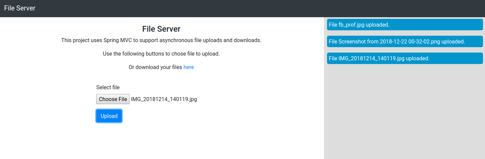
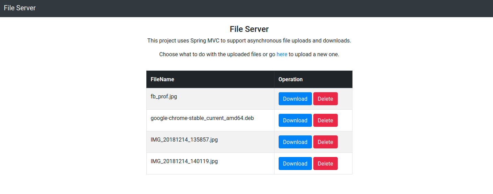

## FileServer Template

#### Overview

A template for a file server backend built with `Spring MVC`, 
to be used in bigger projects.  

The server handles file related requests asynchronously and for each upload it 
sends a notification to the user with `Server Sent Events`. 
No authentication mechanism is included and the UI is simple, since this is meant 
to be a minimal template.

The server supports :
* file upload
* getting the list of uploaded files
    * the current implementation disregards subdirectories, but can be changed by 
    changing the *FileSearching* interface implementation.
* download a file
* delete a file

#### Notes

In *fileserver.properties* there are options for selecting a storage location 
as well as the size of the thread pool that will execute the file serving tasks. 

###### Screenshots

